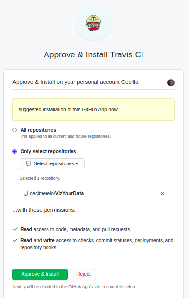
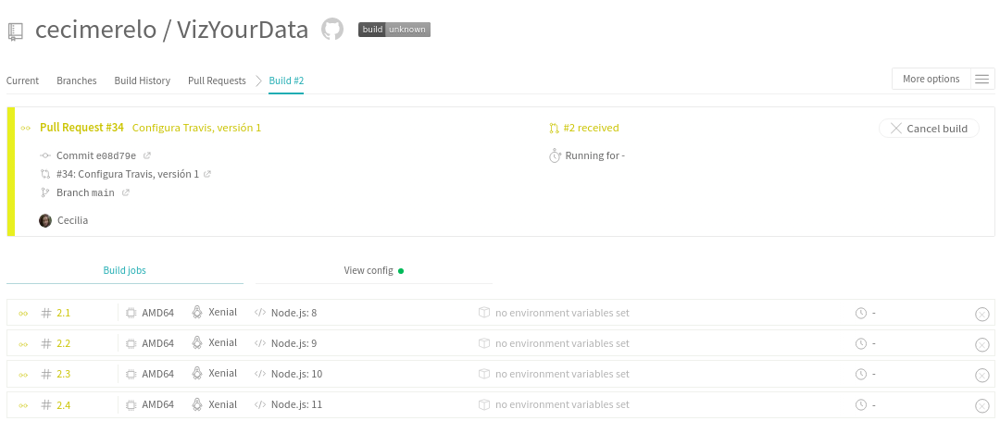

## Configuración de Travis

1. Nos damos de alta en Travis con Github:

  

2. Activamos el repositorio de nuestro proyecto para poder usarlo en Travis
  
    

3. Añadimos un fichero .travis.yml y lo subimos a Github, de esta manera le indicamos
a Travis qué hacer. Cuando hagamos push podremos ver que aparece el build de Travis:
    
    

Ahora podremos ver cómo se ha activado la construcción en Travis con todas
 las versiones que hemos indicado en el fichero de configuración:

En nuestra primera versión del fichero de configuración de Travis se ha probado con Node 8 a la 11, y han fallado
la 8 y la 9 como podemos ver en la siguiente imagen:

Entonces sabemos que dichas versiones no funcionan para nuestro proyecto así que las eliminamos. Probamos también a 
añadir la última versión de node.